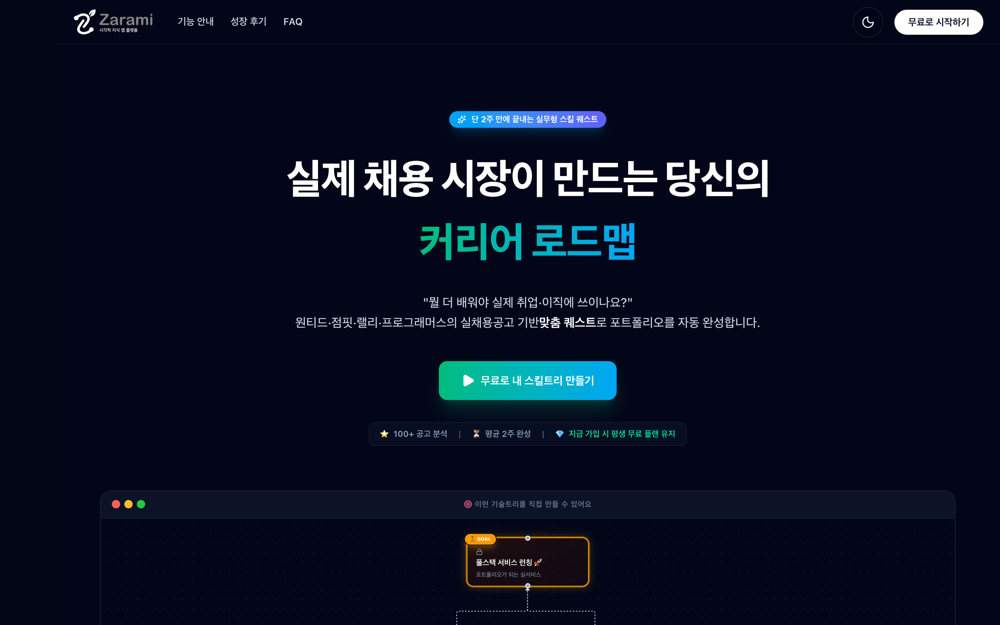
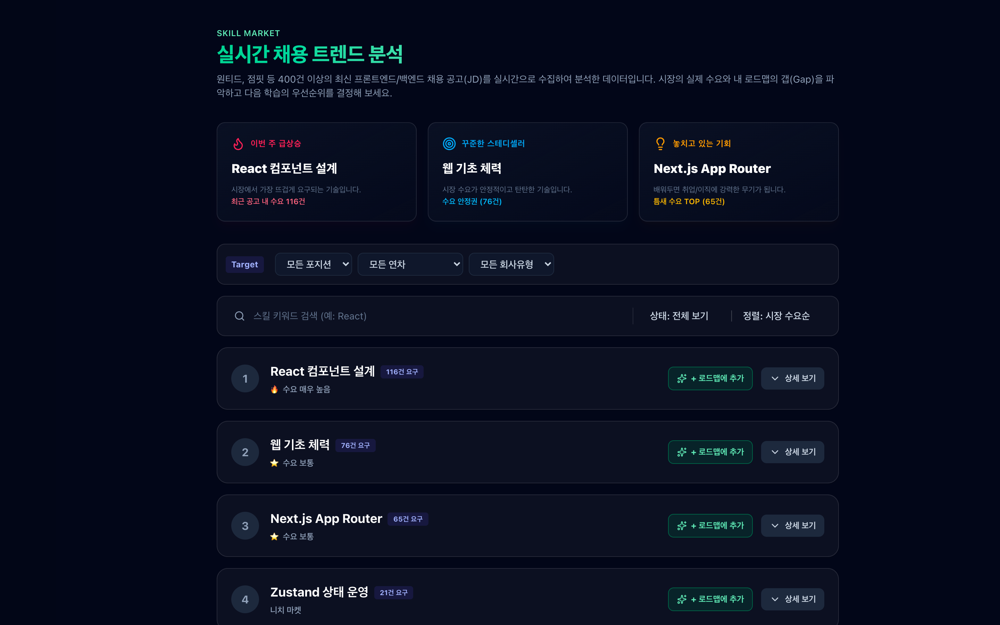
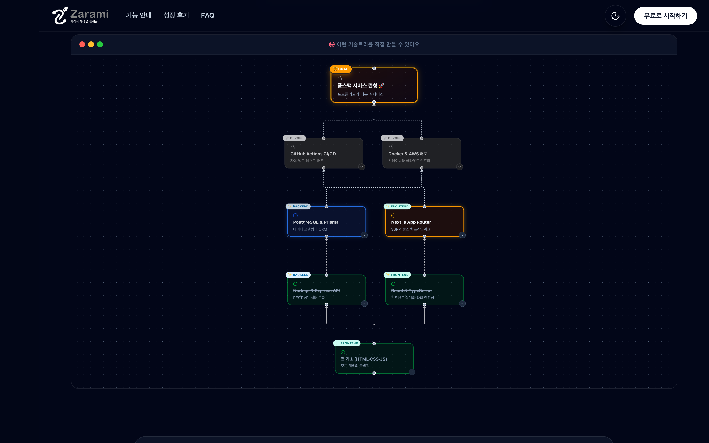
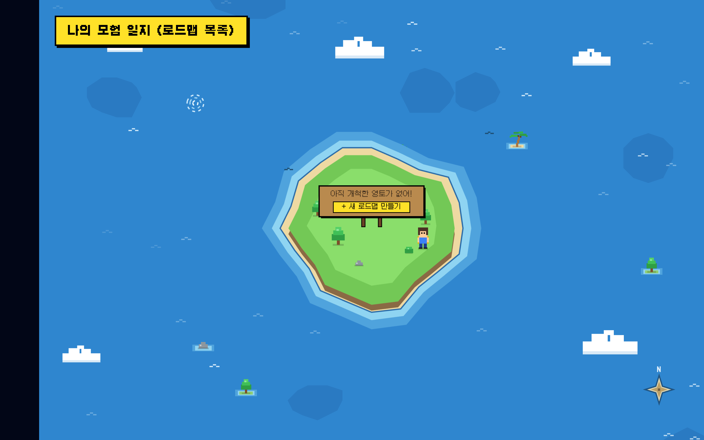
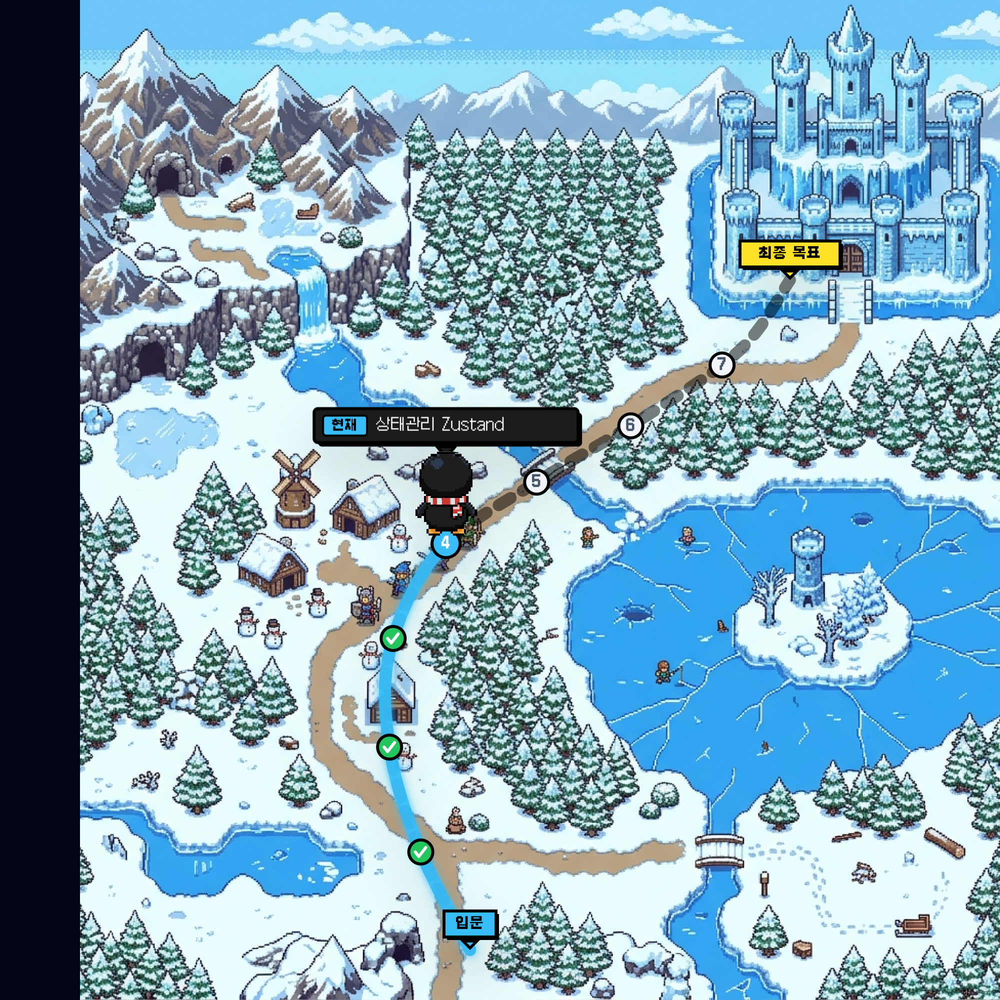
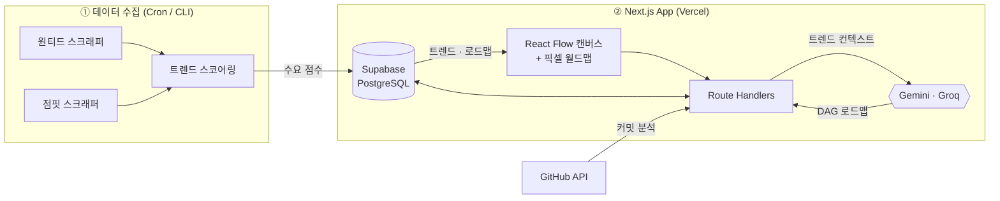
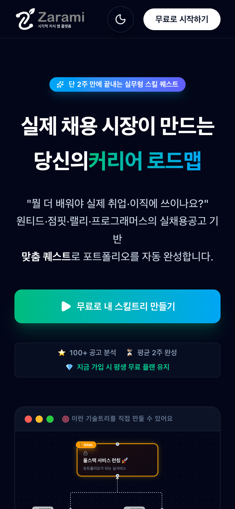

<div align="center">

# 🌿 자람이 (Zarami)

### 실제 채용 시장이 그려주는, 게임 같은 커리어 로드맵

“뭘 더 배워야 실제 취업·이직에 쓰이나요?” — 원티드·점핏의 **실제 채용 공고 400건+** 를 스크래핑해
지금 시장이 원하는 스킬로 **AI가 로드맵을 그려주고**, 레트로 픽셀 월드맵 위에서 퀘스트를 깨며 성장하는 서비스입니다.

<br/>

[](https://zarami-iota.vercel.app)

<br/>


<br/>



</div>

---

## 🧭 왜 자람이인가

주니어에서 미들·시니어로 넘어가는 개발자가 가장 많이 겪는 문제는 실력 부족이 아니라 **방향성 상실**입니다.

> _"강의는 많은데, 이걸 배우면 실제 취업에 도움이 되긴 하나?"_
> _"로드맵.sh는 너무 방대하고, 내 상황엔 안 맞아."_

자람이는 **추상적인 커리큘럼 대신 실시간 채용 시장 데이터**를 근거로 삼습니다.
지금 원티드·점핏에서 실제로 요구하는 스킬 → AI 로드맵 → 실무형 퀘스트 → GitHub 스킬 인증 → 채용 공고 지원까지, **"학습"과 "취업" 사이의 끊긴 고리**를 하나로 잇는 것이 목표입니다.

<br/>

## ✨ 주요 기능

### 📊 실시간 채용 트렌드 분석

원티드·점핏의 최신 공고 **400건+** 를 Puppeteer로 스크래핑하고, 스킬별 언급 빈도를 집계해 **수요 점수(High / Medium / Low)** 로 정량화합니다. "이번 주 급상승 · 꾸준한 스테디셀러 · 놓치고 있는 기회"로 시장을 한눈에 읽고, 다음 학습의 우선순위를 데이터로 정할 수 있습니다.

<div align="center">

</div>

### 🤖 AI 로드맵 생성 (트렌드 근거)

목표(예: "프론트엔드 취업")를 입력하면, 실시간 트렌드 데이터를 컨텍스트로 받은 **Gemini**가 뻔하지 않은 **DAG(방향성 비순환 그래프) 로드맵**을 생성합니다. 각 노드는 선행 관계(prerequisite)를 갖고, TypeScript·Git/PR·테스팅 같은 **자기완결적 기반 스킬**과 현실적인 소요 시간, 실무형 미니 퀘스트까지 포함합니다.

- 🎯 **JD 갭 분석** — 지원하려는 회사의 채용 공고를 붙여넣으면, 내 현재 스킬과 비교해 **단기 갭 좁히기 스프린트**를 그려줍니다.
- 🧩 **개인화 편집** — 생성된 트리를 직접 드래그·연결·추가하며 나만의 테크트리로 다듬을 수 있습니다.

<div align="center">

</div>

### ⚔️ 게임화된 스킬 모험 지도 (World Map)

딱딱한 트리 대신 **레트로 픽셀 RPG 월드맵**으로 몰입감을 높였습니다. 로드맵 하나가 곧 하나의 **영토(섬)** 가 되고, 로드맵을 열면 각 지도의 실제 길을 따라 **입문 → 성장 → 최종 목표(성)** 로 이어지는 모험 경로가 펼쳐집니다. 완료한 노드는 체크(✓), 현재 단계엔 캐릭터가 서 있어 **"내가 어디까지 왔는지"** 가 한눈에 보입니다.

<table>
<tr>
<td width="50%" align="center">
<br/>
<sub><b>전체 지도</b> — 로드맵마다 하나의 섬(영토)</sub>
</td>
<td width="50%" align="center">
<br/>
<sub><b>상세 지도</b> — 단계별 마커를 따라가는 모험 경로</sub>
</td>
</tr>
</table>

### 📝 실무형 퀘스트 & 완료 검증

각 스킬 노드는 이론 암기가 아니라 **"이력서·포트폴리오에 쓸 수 있게 증명하는" 미니 프로젝트 퀘스트**를 제공합니다. 완료는 버튼 한 번이 아니라 **체크리스트(서브 퀘스트)를 모두 통과**해야 인정되어 학습 검증이 흐트러지지 않습니다.

### 💼 GitHub 스킬 인증 & 채용 연계

GitHub URL을 넣으면 AI가 커밋 내역을 분석해 어떤 스킬을 실제로 다뤘는지 **인증(Certified)** 하고, 스킬을 채운 뒤에는 그 스킬을 요구하는 **실제 채용 공고로 바로 연결**됩니다.

<br/>

## 🛠️ 기술 스택

| 영역 | 사용 기술 |
| --- | --- |
| **Frontend** | Next.js 15 (App Router) · React 19 · TypeScript 5 · Tailwind CSS v4 |
| **시각화** | React Flow (`@xyflow/react` v12) · Dagre (auto-layout) · 커스텀 SVG 월드맵 · react-zoom-pan-pinch |
| **상태·데이터** | Zustand · TanStack Query (React Query) · Zod |
| **Backend & DB** | Supabase (PostgreSQL · Auth · RLS) · Next.js Route Handlers |
| **AI** | Google Gemini (`gemini-flash-latest`) · Groq (`llama-3.1-8b-instant`) |
| **데이터 파이프라인** | Puppeteer 기반 원티드·점핏 스크래퍼 → 트렌드 스코어링 |
| **기타** | next-themes(다크모드) · lucide-react · Vercel 배포 |

<br/>

## 🏗️ 아키텍처



**핵심 흐름:** 스크래퍼가 실채용 공고를 모아 트렌드 점수를 계산 → Supabase에 저장 → 사용자가 목표를 입력하면 그 트렌드를 근거로 AI가 로드맵(nodes/edges JSONB)을 생성 → React Flow·월드맵으로 시각화하고 퀘스트 진행 상태를 다시 Supabase에 영구 저장.

<br/>

## 🚀 로컬 실행

```bash
# 1. 패키지 설치
npm install

# 2. 환경 변수 설정
cp .env.local.example .env.local   # 아래 표 참고해 값 채우기

# 3. 개발 서버 실행 (Turbopack)
npm run dev
# → http://localhost:3737
```

### 필수 환경 변수 (`.env.local`)

| 변수 | 역할 | 필수 |
| --- | --- | :---: |
| `NEXT_PUBLIC_SUPABASE_URL` | Supabase 프로젝트 URL | ✅ |
| `NEXT_PUBLIC_SUPABASE_ANON_KEY` | Supabase 익명 키 (클라이언트) | ✅ |
| `SUPABASE_SERVICE_ROLE_KEY` | 서버 사이드 관리자 키 | ✅ |
| `GEMINI_API_KEY` | 로드맵·노드 생성, JD 갭 분석, GitHub 연동 | ✅ |
| `GROQ_API_KEY` | 스킬 상세/퀘스트 빠른 생성 | ✅ |
| `GITHUB_TOKEN` | GitHub API Rate Limit 완화 | 선택 |

### 데이터베이스 마이그레이션

```bash
# Supabase 프로젝트에 스키마 적용 (skills, user_trees, RLS 정책 등)
supabase db push
```

### 채용 트렌드 갱신

로컬 또는 Cron에서 실제 공고를 긁어와 트렌드 점수를 업데이트합니다.

```bash
npm run update-trend       # 원티드·점핏 스크래핑 → Supabase 반영
```

<br/>

## 📁 프로젝트 구조

```text
src/
├── app/
│   ├── api/                # generate-tree · gap-tree · node-details · github-sync · recommend-node
│   ├── world-map/          # 스킬 모험 월드맵
│   ├── dashboard/          # 기술트리 성장 캔버스
│   ├── trends/             # 실시간 채용 트렌드
│   ├── manage-tree/        # 로드맵 DIY 편집기
│   └── profile · resume · login
├── components/
│   ├── world-map/          # OverworldMap(절차적 군도) · WorldMapOverlay(모험 경로)
│   ├── skill-tree/          # TechTreeCanvas (React Flow)
│   └── Drawer.tsx           # 노드 상세 · 퀘스트 · 완료 검증
├── hooks/ · stores/ · lib/  # React Query 훅 · Zustand · dagre 레이아웃
supabase/migrations/         # DB 스키마 & RLS
scripts/                     # 스크래퍼 · 트렌드 스코어링 · 시드
```

<br/>

## 📱 이런 화면들

<div align="center">

&nbsp;&nbsp;

</div>

<br/>

## 🗺️ 로드맵

- [x] 실시간 채용 트렌드 스크래핑 & 스코어링
- [x] 트렌드 근거 AI 로드맵 생성 (DAG)
- [x] 게임화 월드맵 & 실무형 퀘스트
- [x] GitHub 커밋 기반 스킬 인증
- [ ] 유저 랭킹(리더보드) & 소셜 기능
- [ ] 채용 공고 매칭 정밀도 고도화

<br/>

## 🚢 배포 (Vercel)

1. Vercel에 GitHub 저장소를 연결합니다.
2. **Environment Variables** 에 위 필수 환경 변수를 등록합니다.
3. `main` 브랜치에 푸시하면 자동 배포됩니다.

<br/>

<div align="center">

**[🚀 지금 바로 체험하기 → zarami-iota.vercel.app](https://zarami-iota.vercel.app)**

_실제 채용 시장이 그려주는 당신의 커리어 로드맵._

</div>
